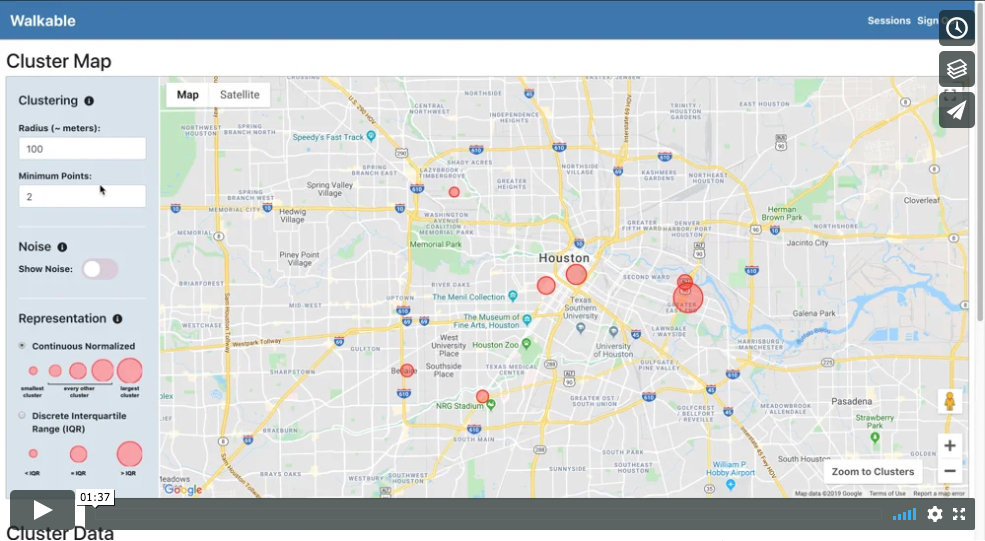

# Walkable

Brief
------

Walkable is a citizen participation and geospatial analysis site that allows users to send their location where they want a crosswalk, and allows admins to cluster, analyze, and visualize location data, or export coordinate tables.

With Walkable, local governments and NGOs can create their own sessions to get feedback from residents on where they want crosswalks. If a city government wanted to collect feedback, they could create a session and give it a name like "walkablecity".  Then, whenever a resident walked to a place where they want to cross, but couldn't, they could simply go to "walkable.herokuapp.com/walkablecity", click a button, and their coordinates would be stored. Once the city government's feedback collection session was over, they could visit their session dashboard. Walkable provides a powerful dashboard that allows users to cluster location data (with or without noise), visualize data on a map, and generate live data tables. Administrators could even export data for integration with their GIS systems or other analysis tools.

View Demo:

Concept 
------ 

There has been a growing movement in the utilization of technology for citizen participation. Cities have started using location sharing technologies to address issues such as potholes and waste. A prime example of this is the city of Dayton, Ohio. Dayton implemented an application where citizens can send pictures of potholes along with their location, and the city will fix the pothole within 48 hours. Successes like this one demonstrate the power of technology when it comes to citizen participation.

While many citizen participation technologies have focussed on providing services, Walkable is focussed on collecting feedback. The ultimate goal, of course, is to provide data that local governments and NGOs can use to provide services. However, not all requests are as straightforward as fixing potholes. Potholes should always be fixed. Crosswalks should not necessarily always be placed where pedestrians want them. Pedestrian feedback is just one piece of information needed for crosswalk placement.

Although pedestrian feedback is just one piece of information, it is critical to urban planning decisions. It is becoming increasingly important to provide effective avenues for collection of feedback in a society where town halls and council meetings no longer have the level of participation they once did. Walkable provides a platform where a pedestrian simply has to click a button to provide feedback. It also allows administrators to analyze and visualize data to see what is most important to pedestrians. Finally, since Walkable's data is accessible via API or CSV export, local governments and NGOs can easily combine pedestrian data with other data to make more informed, comprehensive decisions.

Technologies 
------ 

Walkable's core functionality, its ability to cluster coordinate data based on adjustable parameters and instantly display cluster data on a map and table, is made possible by combining the DBSCAN clustering algorithm and center point algorithm with Google Maps APIs and React.js. Walkable also utilizes a CSV-export npm package to allow users to export raw coordinate data or structured cluster data for integration with GIS or other systems.

* HTML
* CSS
* Bootstrap
* React.js
* Redux
* JavaScript
* Node.js
* Express.js
* REST API
* PostgreSQL
* Sequelize ORM
* Bcrypt

Team
------

* [Kelsey Gaetjens](https://github.com/kjgaetjens/)